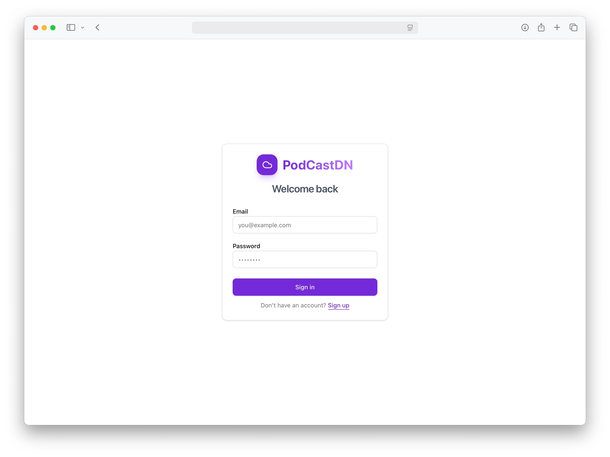
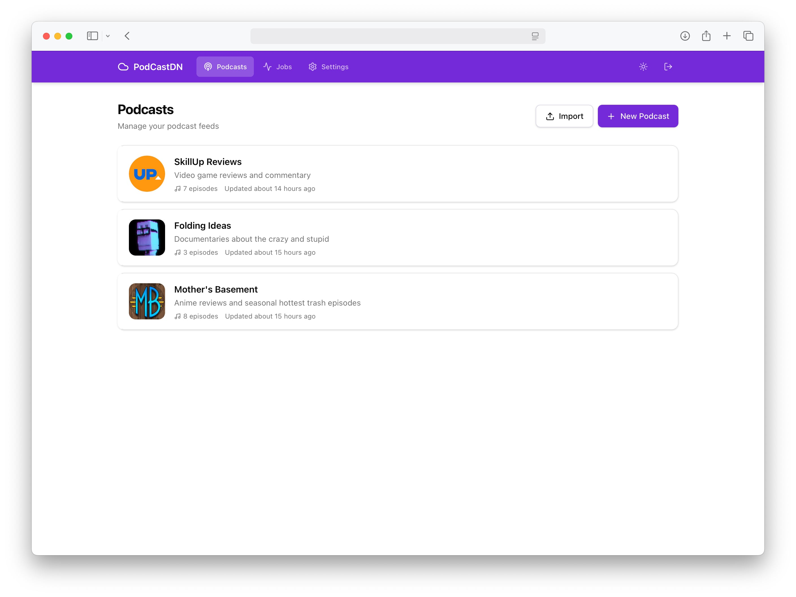
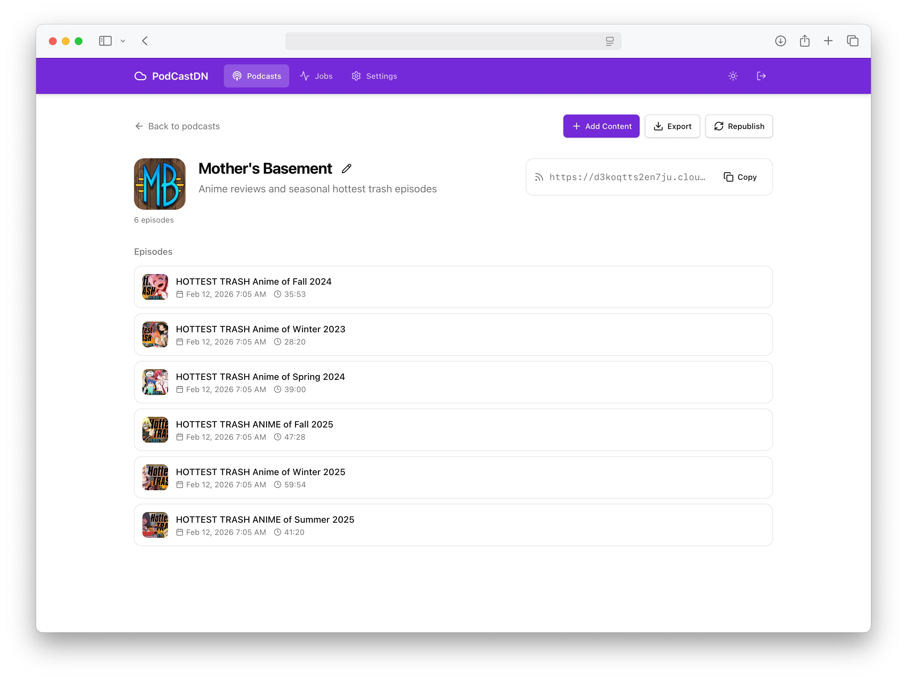

# PodCastDN

Podcast -> CDN = **PodCastDN**

A self-hosted YouTube video/playlist to podcast generator that uploads to S3 and CloudFront.

**WARNING:** This project was largely written by Claude Opus 4.6. Be careful trusting it with your credentials.

# Features

- **Multi-user authentication** — Email/password with OAuth support
- **Multiple podcast feeds** — Create and manage independent feeds
- **YouTube integration** — Add individual videos or entire playlists
- **RSS 2.0** compatible feeds
- **S3 + CloudFront** storage with custom domain support
- **Dark mode** with system preference detection
- **Docker** deployment ready

# Getting started

1. [Set up AWS and get the access and secret keys](docs/aws.md)
1. [Configure environment variables](docs/env.md)
1. [Run the server](docs/dev.md)

# Screenshots

